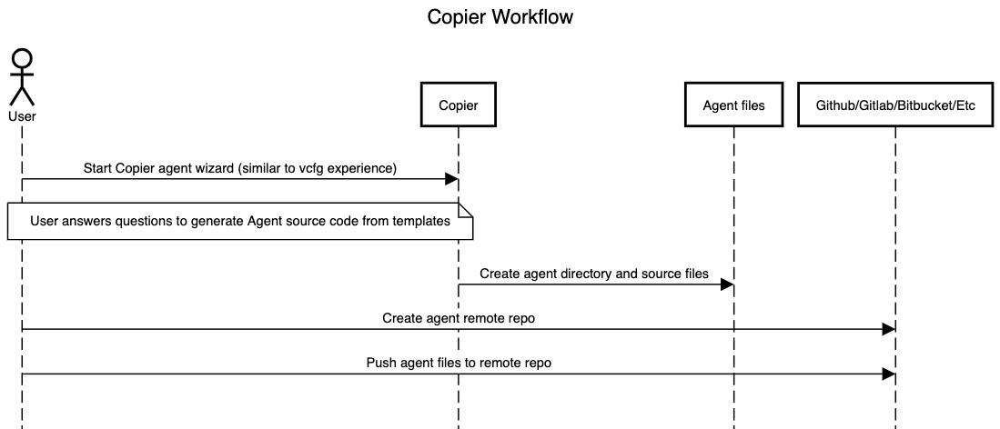

# Copier VOLTTRON Agent

[Copier](https://github.com/copier-org/copier) template
for Python projects managed by [Poetry](https://github.com/python-poetry/poetry).

Many thanks to the project [copier poetry](https://github.com/pawamoy/copier-poetry)
for starting this project and allowing the reuse of the codebase.  Without this
starting point the agent templates would not be what they are today!


# Quick setup and usage

## Prerequisites
This version of copier-poetry-volttron-agent template relies on copier >= 7. 
To use copier
* Install Python 3.7 or newer (3.8 or newer if you're on Windows).
* Install Git 2.27 or newer.
* To use as a CLI app: pipx install copier
* To use as a library: pip install copier or conda install -c conda-forge 

Please see more detail at [Copier Installation](https://copier.readthedocs.io/en/stable/#installation)

## Usage

Use the copier CLI tool to create an agent project from the Volttron Copier templates. The command
takes the form of:

`copier <URL to copier template repo> <path to agent project on local machine>`

The following is an example:
```bash
copier "https://github.com/VOLTTRON/copier-poetry-volttron-agent.git" /path/to/your/new/project
```

Or even shorter:

```bash
copier "gh:VOLTTRON/copier-poetry-volttron-agent" /path/to/your/new/project
```

NOTE: By default, copier use the latest release found in the template git tags.
want to use a specific template version, use the `--vcs-ref` flag, which takes a commit hash associated with your desired
template version. See [documentation for this flag](https://copier.readthedocs.io/en/latest/configuring/#vcs_ref).


# Features

- [Poetry](https://github.com/sdispater/poetry) setup, with pre-defined `pyproject.toml`
- Documentation built with [Sphinx](https://www.sphinx-doc.org/en/master/)
- Pre-configured tools for code formatting, quality analysis and testing:
    - [yapf](https://github.com/google/yapf)
    - [isort](https://github.com/timothycrosley/isort),
    - [mypy](https://github.com/python/mypy),
    - [safety](https://github.com/pyupio/safety)
- Tests run with [pytest](https://github.com/pytest-dev/pytest) and plugins,
  with [coverage](https://github.com/nedbat/coveragepy) support
- Support for GitHub workflow and Gitlab CI
- Auto-generated `CHANGELOG.md` from git commits (using Angular message style)
- All licenses from [choosealicense.com](https://choosealicense.com/appendix/)


# Development

## Copier Workflow diagram



After you have created your Agent project with the copier template and have
successfully installed all the dependencies, your development workflow
would be the following:

Steps:

1. Modify agent code as needed.
2. Create a local repository: `git init`
3. Add the remote repository to your local repository: `git remote add origin <git or gitlab URL>`
4. Stage all code changes to be committed: `git add .`
5. Commit your changes: `git commit -m "Initial commit"`
   * Optional: you can include pre-commit hooks as part of your development workflow so that those hooks are ran before every commit
     * To install pre-commit hooks, run `pre-commit install` at the root level of your Agent project
6. Push changes to the remote: `git push -u origin main`
